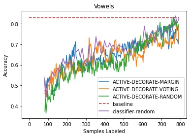

# ACTIVE-DECORATE
A Python implementation of the ACTIVE-DECORATE algorithm presented in [Diverse Ensembles for Active Learning](https://arxiv.org/abs/1511.06434), Prem Melville, Melvin J. Mooney.

## Introduction
Active learning is a special type of machine learning in which a model can query the user or other external data source (the "oracle") to label data points. Active learning thrives in scenarios where there is an abundance of unlabeled data, but a high cost associated with labeling it. The motivating principle is that a learner can selectively query the oracle to label the instances for which it is most uncertain (i.e., closest to the decision boundary).

## Algorithm
ACTIVE-DECORATE is based on the DECORATE algorithm (Melville and Mooney, 2003). DECORATE seeks to create a diverse ensemble of classifiers by incrementally adding classifiers that are consistent with the training data, yet maximally different from the current ensemble. This classifier is constructed by generating artificial data with class labels chosen with probability inversely proportional to the class membership probabilities of the current model. ACTIVE-DECORATE iteratively invokes DECORATE to build a committee of diverse learners, and then queries the oracle to label m datapoints that maximize a utility function, chosen to capture the level of disagreement among the constituent models as to what the label ought to be. The authors choose the generalized margin as the utility function. I implement this as well as the "voting entropy" function discussed in (Argamon-Engelson et al., 1999).

## Data
I tested ACTIVE-DECORATE on the `soybeans` and `vowels` datasets. The single most informative example was labeled every iteration (if this becomes too computationally expensive, increase this). Gaussian Naive Bayes was used as the base learner fot `soybeans`, and ID3 for `vowels`. Each dataset had 50 initially-labeled examples. The maximum community size for DECORATE was set to 15. The results can be seen below.

